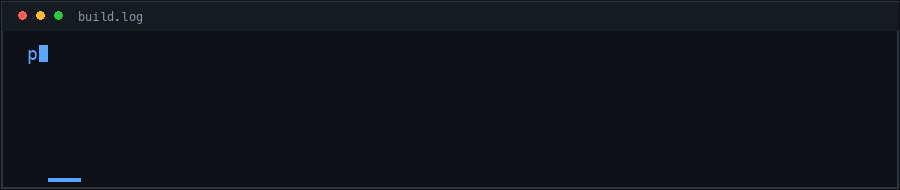

# Hey, I’m Pratham 👋

### Front-end developer building thoughtful, responsive web experiences

I enjoy turning ideas into clean, accessible interfaces and growing into a well-rounded full-stack developer. Most of my work lives at the intersection of **React**, thoughtful UI design, and practical web development.

## About me

- 🔭 Building front-end and full-stack web projects
- 🌱 Exploring system architecture and how scalable applications are designed
- 💬 Happy to talk about React, Node.js, Express, and modern UI development
- ☕ Usually improving an interface one small detail at a time

## Tech stack

**Frontend**

**Backend & data**

**Tools & deployment**

## Selected work

| Project | What it is |
| --- | --- |
| [Velvet Pour](https://github.com/Pratham707-S/Velvet-Pour) | A polished web interface project. |
| [E-commerce React Course](https://github.com/Pratham707-S/ecommerce-react-course) | E-commerce work built while learning React. |
| [Video Calling App](https://github.com/Pratham707-S/video-calling-app) | An experiment in building a video-calling experience. |
| [Portfolio](https://github.com/Pratham707-S/portfolio) | A collection of my work and experiments. |

## GitHub streak

  

---

**Thanks for stopping by. Feel free to explore my repositories or follow along as I keep building.**

